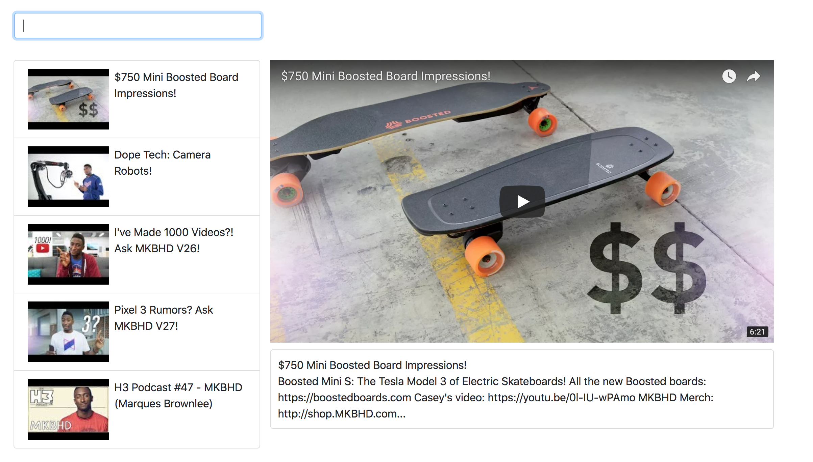

# Youtube Clone in React

Simple Youtube Clone that I'm making to learn React. Currently following along with Stephen Grider's tutorial. Changed styling to personalize looks :smile:



### Prerequisites

- node and npm
- make sure to also have a Youtube API key and throw it in your .env file and set the variable name to: API_KEY

- Installation MacOS
```
brew install node
```

- Cloning
```
git clone https://github.com/JKirkYuan/IMakeYoutubeClone.git
```
- dotenv
```
touch .env
API_KEY = 'YOUR_API_KEY'
```

## Deployment

- Run command
```
npm start
```

## License

This project is licensed under the MIT License - see the [LICENSE](LICENSE.MD) file for details
